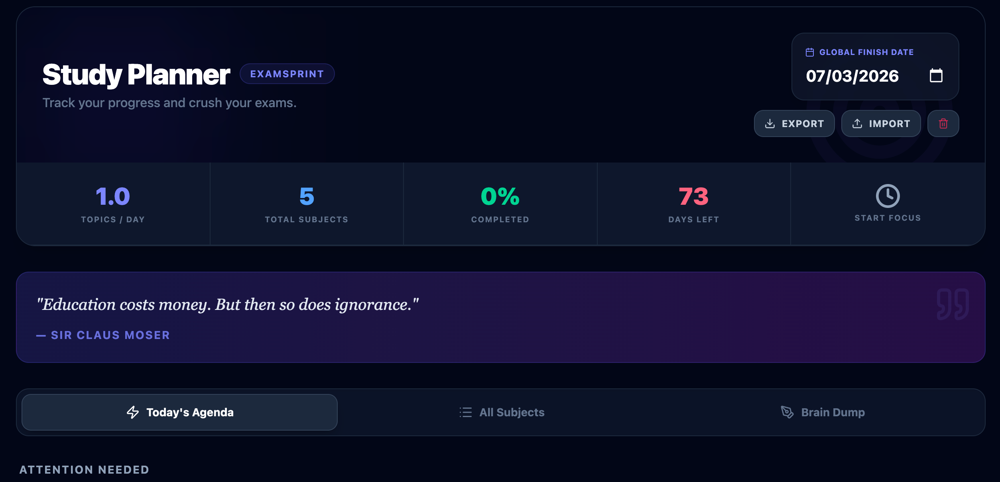
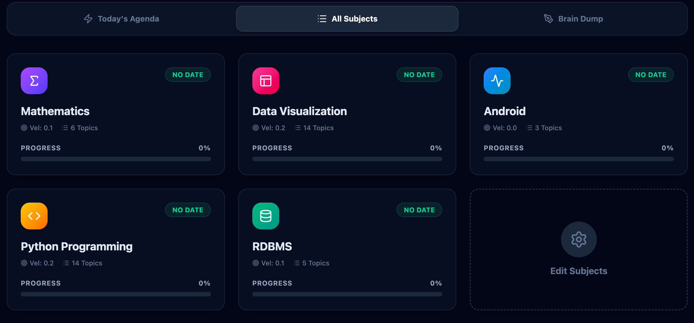
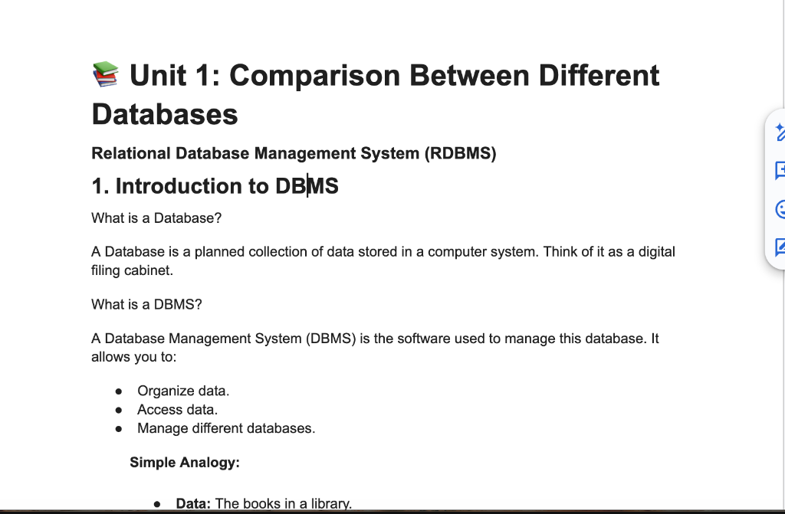

# 🎯 Goal Tracker: The Ultimate Productivity Suite



> **Unlock your potential with a modular tracking system designed for high achievers.**

**Goal Tracker** is an all-in-one productivity platform built to help you master different areas of your life. Instead of juggling multiple apps, Goal Tracker unifies specialized tracking modules under one beautiful, privacy-focused roof.

---

## 🚀 active Module: ExamSprint

**ExamSprint** is the flagship module currently live in Goal Tracker. It is an intelligent study planner designed to help students crush their exams with mathematical precision.

### ✨ ExamSprint Features

#### 🎯 **Smart Velocity Engine**
- **Dynamic Pacing**: Automatically calculates how many topics you need to cover *today* to finish by your exam date.
- **Urgency Detection**: topics are flagged with urgency levels (Comfortable, Moderate, Sprint Mode, Critical) to keep you on track.
- **Global vs. Exam Dates**: Set a global "finish all" date or individual exam dates for each subject.

#### 📝 **Advanced Markdown Editor**
- **Rich Text Paste**: Copy tables, lists, and formatted text from Wikipedia, Google Docs, or Word, and paste them directly as clean Markdown.
- **Live Preview**: Split-screen editing with instant rendering.
- **Syntax Highlighting**: Beautiful code blocks for CS students.
- **Brain Dump**: A dedicated scratchpad for quick thoughts, auto-saved instantly.

#### 📄 **One-Click PDF Export**
- **Smart Formatting**: Converts your Markdown notes into professionally styled PDFs.
- **Context-Aware Filenames**: Downloads are automatically named (e.g., `Python - Recursion.pdf`) for easy organization.

#### 💾 **Data Management (New!)**
- **Export & Share**: Export your entire workspace (subjects, notes, progress) to a JSON file. Backup your data or share your study plan with friends.
- **Import**: Restore your progress from any exported file.
- **Reset**: One-click "Nuclear Reset" to wipe all data and start fresh (protected by double confirmation).

#### ⚡ **Bulk Operations (New!)**
- **Bulk Subject Creation**: Paste a list of subjects (e.g., from your syllabus PDF) during onboarding to create them all at once.
- **Bulk Topic Edit**: Swiftly replace a subject's topics by pasting a list. The system automatically cleans up numbering (e.g., "1. Unit 01" becomes "Unit 01").

### 📸 Screenshots

| **Interactive Dashboard** | **Smart Rich Paste** |
|:---:|:---:|
|  |  |
| *Track velocity, topics, and exam dates at a glance.* | *Paste from the web directly into Markdown tables.* |

---

## 🔮 Coming Soon: Future Modules

Goal Tracker is built to scale. We are actively developing new modules to help you track more than just grades:

- **🏋️ Fitness Tracker**: Log workouts, track PRs, and monitor calorie intake.
- **💰 Finance Tracker**: Budgeting, expense tracking, and savings goals.
- **📚 Reading List**: Track books, reading speed, and notes.

---

## 🛠️ Tech Stack

- **Frontend**: React 19, Vite, Tailwind CSS v4
- **Icons**: Lucide React
- **Text Processing**:
    - `react-markdown` & `remark-gfm` (Rendering)
    - `turndown` (HTML-to-Markdown conversion)
    - `html2pdf.js` (Export)
- **State**: LocalStorage persistence (Privacy-first)

---

## 🚀 Getting Started

1.  **Clone the repository**
    ```bash
    git clone https://github.com/yourusername/goal-tracker.git
    cd goal-tracker
    ```

2.  **Install dependencies**
    ```bash
    npm install
    ```

3.  **Run the development server**
    ```bash
    npm run dev
    ```

4.  **Build for production**
    ```bash
    npm run build
    ```

---

## 🤝 Contributing

We welcome contributions! Whether it's adding a new feature to ExamSprint or building a completely new module:

1.  Fork the repo.
2.  Create a feature branch (`git checkout -b feature/amazing-feature`).
3.  Commit your changes.
4.  Open a Pull Request.

---

## 📄 License

MIT License © 2024 Goal Tracker Team
